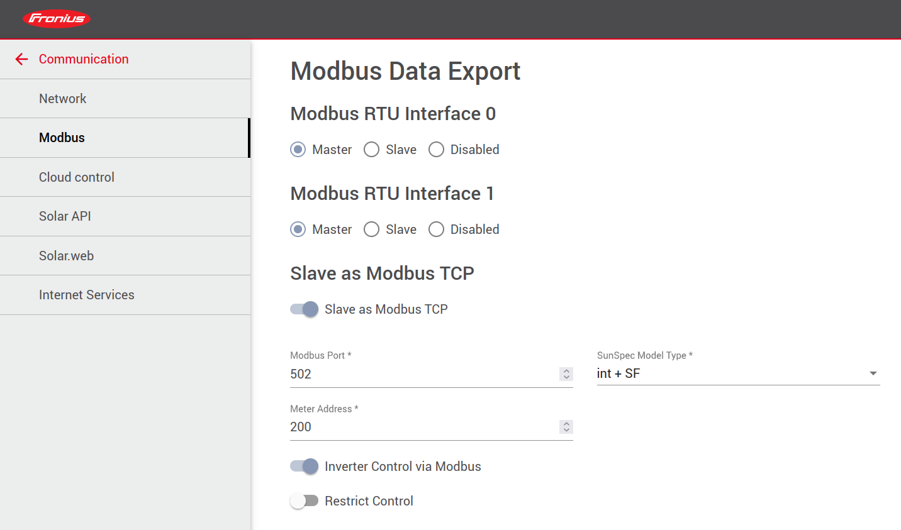
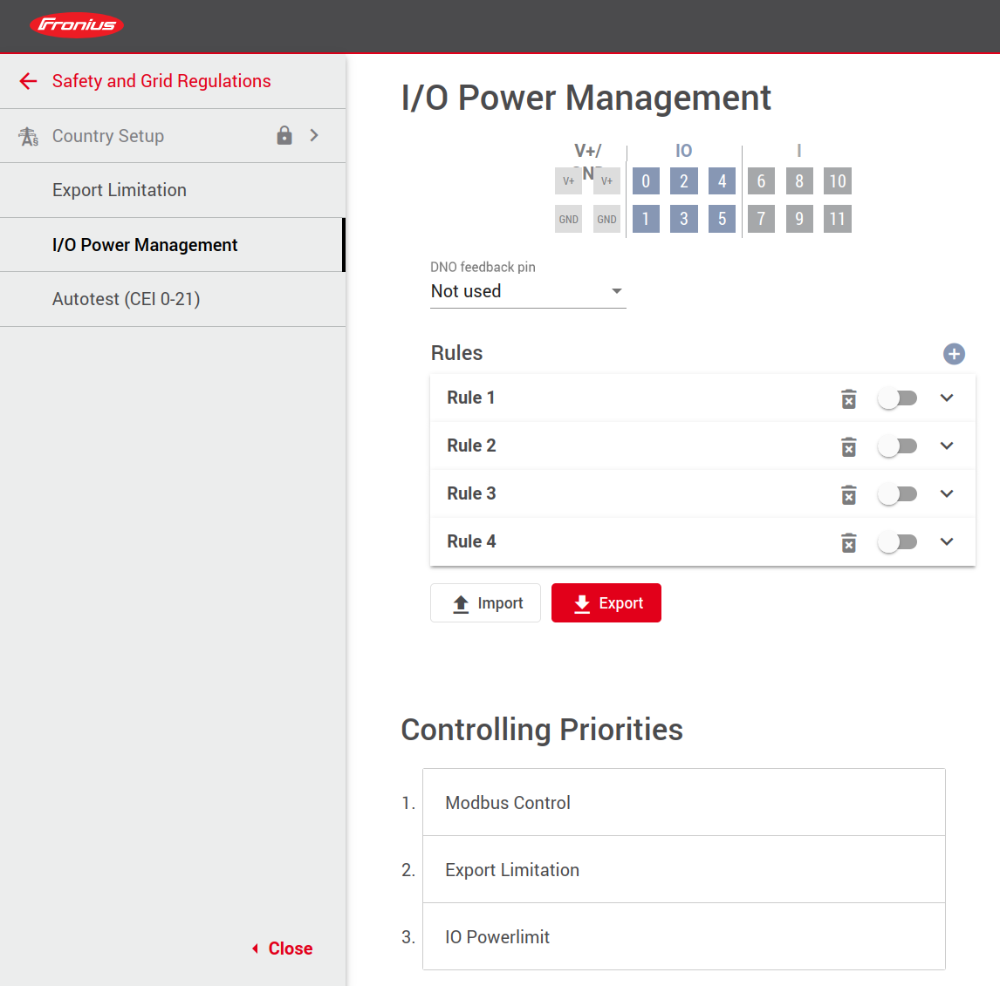
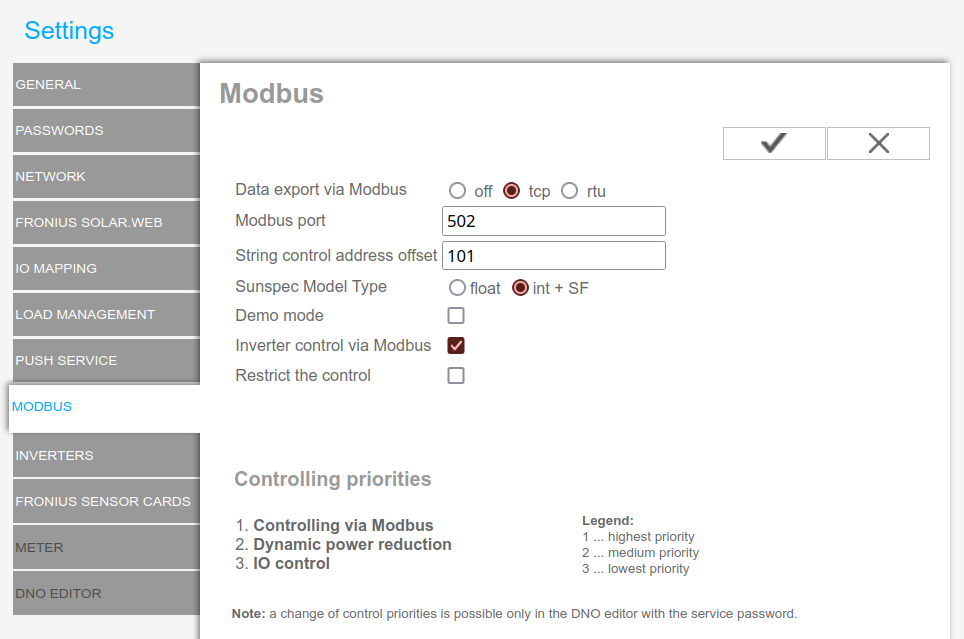
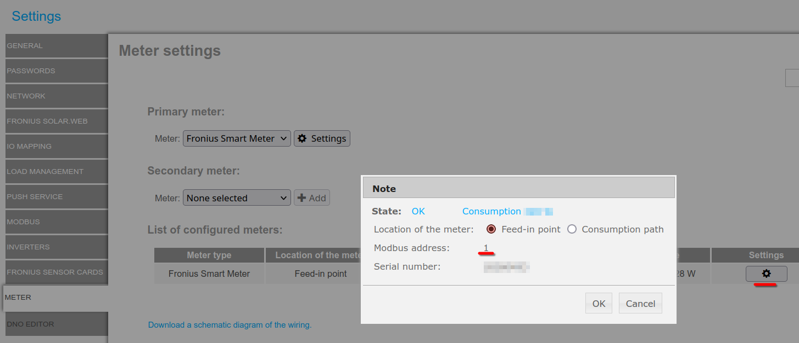

# Fronius Inverters - Modbus TCP setup

Modbus TCP is the communication protocol used to communicate the inverter with other software components and must be enabled for this program to work. You may need advanced user credentials to be able change the inverter settings. Ask your installer.

## Fronius GEN24 inverters

- Enable `Inverter Control via Modbus`
- Ensure `int + SF` is selected as SunSpec Model Type
- Note de values of `Modbus Port` and `Meter Address` because you will need them for the config file. See below



If you want to use the battery charge control feature, you will have to put `Modbus Control` at control priority 1.



Reference config file for the above images:
```yaml
inverter_modbus_tcp:
  host: 192.168.4.1 # put your real inverter IP address
  port: 502
  meter_id: 200
```

## Fronius SnapINverter

- Select `tcp` on `Data export via Modbus`
- Enable `Inverter control via Modbus`
- Ensure `int + SF` is selected as Sunspec Model Type
- Note de value of `Modbus Port` because you will need it for the config file. See below



Reference config file for the above image:
```yaml
inverter_modbus_tcp:
  host: 192.168.4.1 # put your real inverter IP address
  port: 502
  meter_id: 240
```

The parameter `meter_id` depends on the meter Modbus Address following this rule: `meter_id = 239 + modbus_meter_address`. If you have more than one meter, you can check the Modbus Address on Meter Settings:



> [!NOTE]
> Battery charge control is not available on Fronius SnapINverters.
